# AI Insights

**English** | [简体中文](README.zh-CN.md)

[](LICENSE)
[](https://buymeacoffee.com/starbringer)

Understand and improve how you use AI coding tools. A local web app that turns raw usage data into a live dashboard — token counts, costs, session history, and configuration health.

Today it parses **Claude Code's JSONL transcripts**. The architecture is provider-agnostic, so other sources can be plugged in over time.

**No AI calls. No external services. All data stays on your machine.**

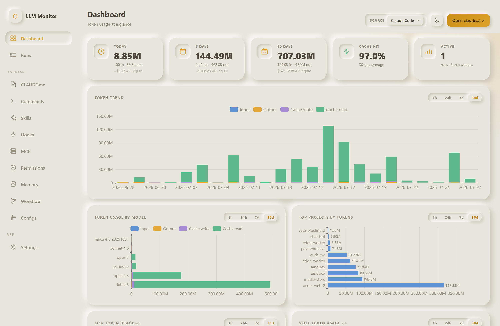

---

## Requirements

- [Bun](https://bun.sh) ≥ 1.1 (tested on 1.3.13)
- **Windows, macOS, or Linux.** The server runs the same everywhere; the auto-open-browser step picks the platform's opener (`open` on macOS, `cmd /c start` on Windows, `xdg-open` elsewhere) and is skipped silently if none is available.
- At least one supported data source — **Claude Code**, with data in `~/.claude/projects/` *(currently the only built-in source)*

## Setup

### 1. Install Bun

```bash
# macOS / Linux
curl -fsSL https://bun.sh/install | bash

# Windows (PowerShell)
powershell -c "irm bun.sh/install.ps1 | iex"
```

Check it: `bun --version`

### 2. Get the code

```bash
git clone https://github.com/starbringer/ai-insights.git
cd ai-insights
```

### 3. Install dependencies

```bash
bun install
```

### 4. Start the app

```bash
bun run start
```

### 5. Open it

The browser opens automatically on Windows, macOS, and Linux (where `xdg-open` exists). Otherwise go to **http://localhost:5757**.

On first start the app scans every transcript under `~/.claude/projects/`, builds
`data/cache.db`, and then watches those files — new activity shows up within a
couple of seconds, no restart needed. A large history takes a few seconds to scan;
the page is usable as soon as the first pass finishes.

If you have no data yet, the app still loads and tells you where it expected to
find it.

### Command-line options

```bash
bun run server.ts --port=8080 --no-browser
```

| Flag | Description |
|------|-------------|
| `--port=N` | Listen on port N (default: `5757`) |
| `--host=H` | Bind address (default: `127.0.0.1`) — the config API can edit files, so it stays loopback-only unless you opt in to `0.0.0.0`. [Why](docs/architecture.md#network-binding) |
| `--no-browser` | Don't auto-open the browser |
| `--static-only` | Skip the file watcher (and the browser) — the startup scan still runs, but changes afterwards aren't picked up until restart |

The environment variables `PORT` and `HOST` work too.

### Scripts

```bash
bun run start        # start the server (same as bun run server.ts)
bun run dev          # hot-reload with --watch
bun run typecheck    # tsc --noEmit
bun run test         # unit test suite
bun run build        # compile a standalone binary for the current platform
```

### Rebuilding the cache

The database is a cache — the JSONL transcripts are the only source of truth.
Delete `data/cache.db` and restart to force a clean re-parse. The app does this by
itself whenever the schema version changes after an update.

### Standalone executable

```bash
bun run build        # → dist/ai-insights (dist/ai-insights.exe on Windows), ~60MB, no Bun install needed
```

The binary embeds the Bun runtime; ship the `static/` folder alongside it. Both
`static/` and the `data/` cache are resolved next to the executable, so it can be
launched from any working directory.

The build targets whatever platform you run it on. To cross-compile, add a target:
`bun build --compile --target=bun-<windows|darwin|linux>-x64 server.ts --outfile dist/ai-insights`
(`bun-darwin-arm64` for Apple Silicon).

---

## Features

*Screenshots below are captured from real usage with every project name, path,
conversation and configuration name replaced by consistent stand-ins — see
[docs/screenshots/](docs/screenshots/).*

### Dashboard

Five KPI cards (today / 7-day / 30-day totals with API-equivalent cost, cache hit
rate, active runs) over a token trend chart split into input, output, cache write
and cache read.

Below it: usage by model, top projects, **MCP token usage** (tokens flowing through
each server's tool calls, with a per-tool tooltip), **skill token usage**, the
**cache hit rate** with a 50% guide line, the **model mix**, and **top 10 runs**
— click any bar to jump straight into that run.

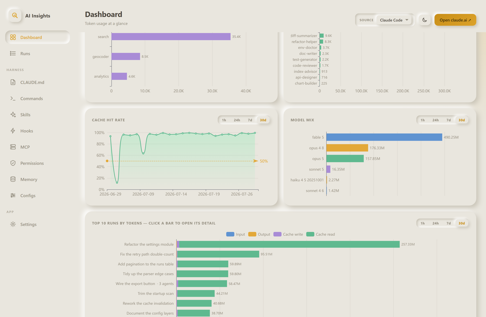

Every chart has its own range switcher — `1h` / `24h` / `7d` / `30d` — and
remembers your choice. Costs are API-equivalent reference numbers from an editable
pricing table, not billing; [details](docs/data-model.md#cost-estimation).

### Runs

Every recorded session with title, project, agent count (`× N` when a run spawned
sub-agents), turns, token totals and last-active time. Searchable and filterable by
project.

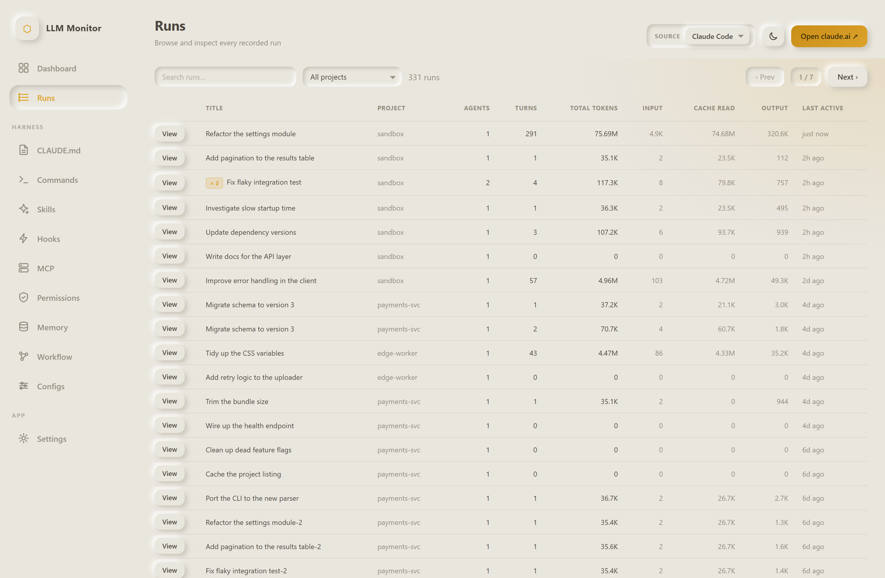

A **run** is one logical session, which contains one or more **agents** (one
transcript each), which contain **turns** (one API call each).
[More on the model](docs/data-model.md#run--agent--turn).

### Run detail — session tree

Click **View** on any run for a three-panel replay of the whole session: agents on
the left, the tree in the middle, full node detail on the right.

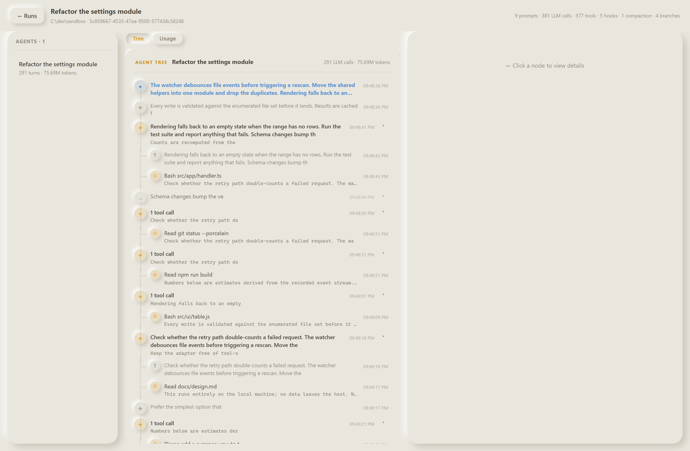

Each agent gets its own tree, stacked in one scrollable view. The spine is the
chronological flow — prompts, LLM calls, hook fires, compactions, errors — and each
LLM call expands into its thinking, text output and every tool call in order: plain
tools ⚙, MCP calls ⇄, sub-agent spawns ◈ (with a `tree ↓` jump link), skill
invocations ❖ with the injected skill body nested underneath. Framework events are
first-class nodes: `⚡` hooks with command and duration, `✕` API errors and
rate-limit retries, `▣` compactions with pre → post token counts, `⤷` model refusal
fallbacks, `✚` injected context. Abandoned branches from prompt edits and retries
collapse into `⎇` sub-trees so the mainline stays readable.

The top bar totals the session: prompts, LLM calls, tools, MCP, sub-agents, hooks,
errors, compactions, branches. On narrow screens the side panels collapse into
top-bar toggles.

### Run detail — usage

The middle column's second tab is a cost breakdown for that one run, computed from
the same deduplicated data as the dashboard.

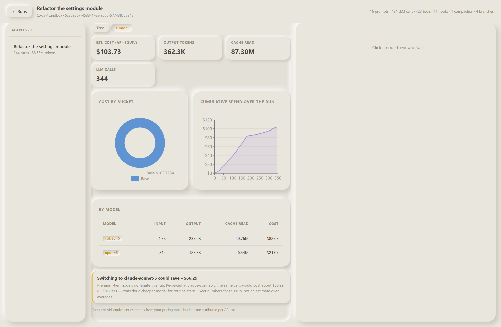

KPI cards, a **cost-by-bucket donut** (base / MCP / skills / sub-agents — every API
call is classified at parse time from its tool calls), a cumulative spend curve, a
per-model table, and **tuning advice** derived from this run's real numbers, e.g.
"re-priced at a cheaper model these calls would cost $X (Y%) less", low cache-hit
warnings, or sub-agent-heavy runs.

### Harness

The **Harness** group inspects — and where safe, edits — the configuration of the
active tool. Each tab appears only if the active provider supports that capability,
so a future adapter for another tool simply shows fewer tabs.

Most of these tabs share one layout: a list column and a detail column beside it,
each scrolling on its own.

#### CLAUDE.md

Every instruction file the tool injects: the global `~/.claude/CLAUDE.md` plus
`CLAUDE.md` / `.claude/CLAUDE.md` for every project your transcripts have touched
(missing ones are listed as creatable). Per-file token and word counts, an inline
editor with **Save**, and a timeline of injected tokens per day.

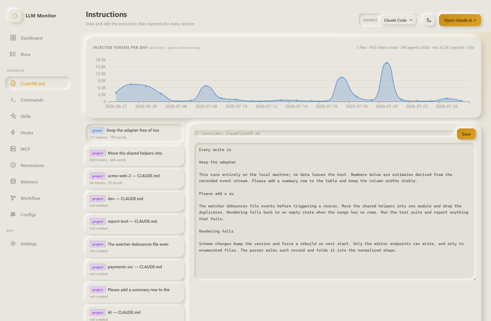

#### Commands

Slash commands from all three sources — user, project and enabled plugins — with
`:`-namespacing, argument hints, `$ARGUMENTS` detection, token cost, search, and
**same-name override detection** so you can see which definition actually wins.
Edit, create and delete user/project commands; plugin commands are read-only.

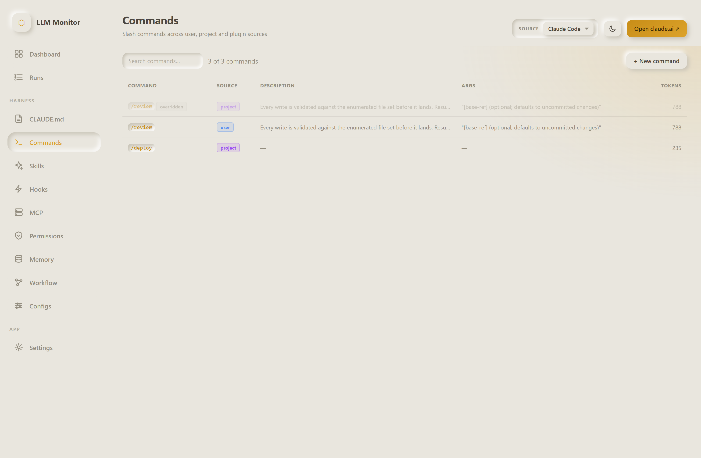

#### Skills

A narrow list, full detail beside it: override detection, SKILL.md
token cost, `references/` and `scripts/` listings, **recorded** invocations and
injected tokens over 30 days, and a **trigger analyzer** showing which prompt
keywords would activate the skill.

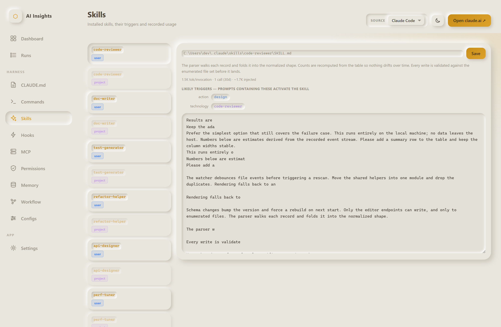

#### Hooks

Every hook across every settings layer, with its matcher, action type and
**recorded fire count** for the last 30 days — recorded from the event stream, not
estimated.

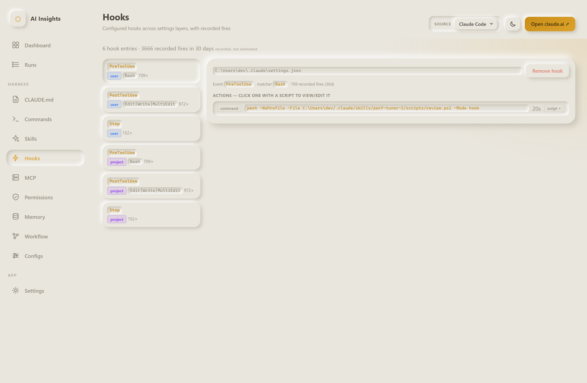

Actions that run a script file (`.ps1`, `.sh`, `.py`, …) are resolved on disk:
click one to read the script, edit it and save. Hooks can also be removed — the
entry is deleted from its settings file, and the script itself is left on disk.

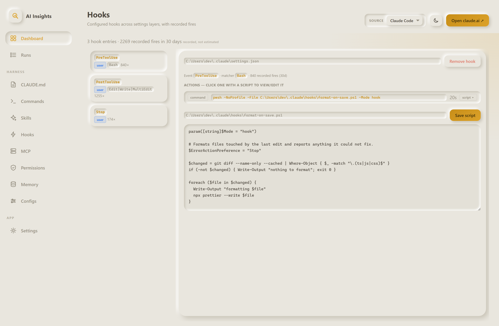

#### MCP

Servers with scope, transport and tool count on the left; command, source file,
probe status, 30-day injection estimate and expandable tools with descriptions and
JSON schemas on the right. Diagnostics live in the default panel and a re-probe
button bypasses the 10-minute cache.

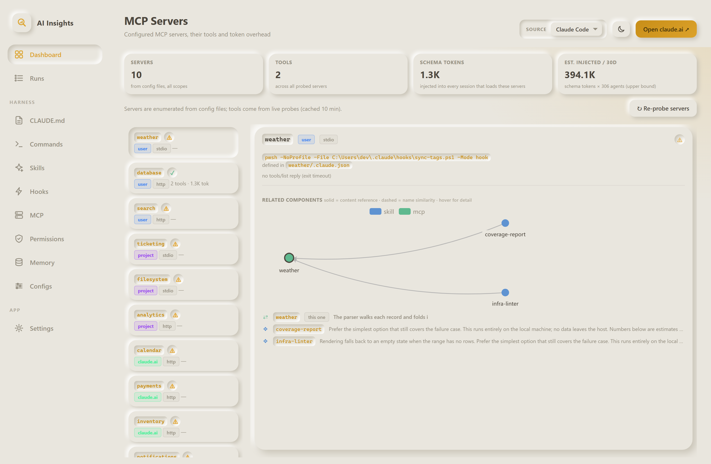

Servers are enumerated from config files rather than the CLI, and project-scope
servers you haven't approved are listed but never executed —
[why](docs/architecture.md#mcp-why-config-files-not-the-cli).

#### Permissions

`allow` / `deny` / `ask` rules parsed into tool + specifier across the user layer
and, via the project selector, a project's settings and local settings. Shows the
merged effective set; a rule shadowed by a higher-priority layer is struck through.

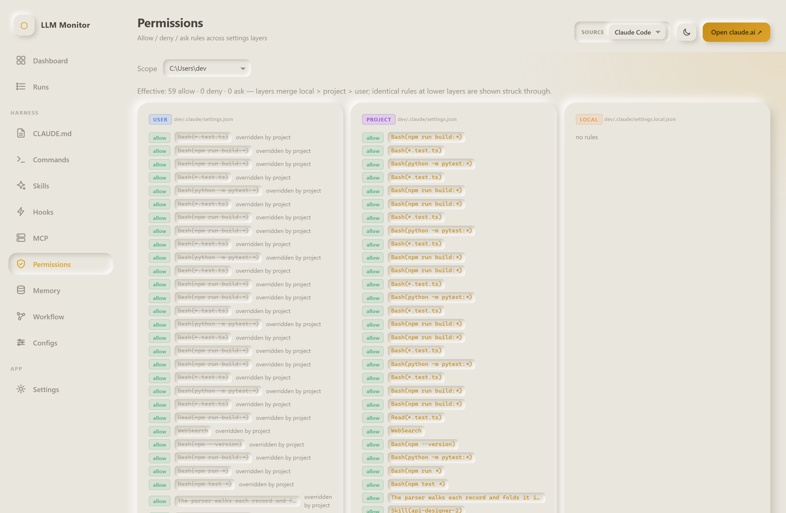

#### Memory

Per-project persistent memory stores: the MEMORY.md index, every topic file with
its content, size and last-modified time, and an **orphan** badge for files that
exist but aren't linked from the index.

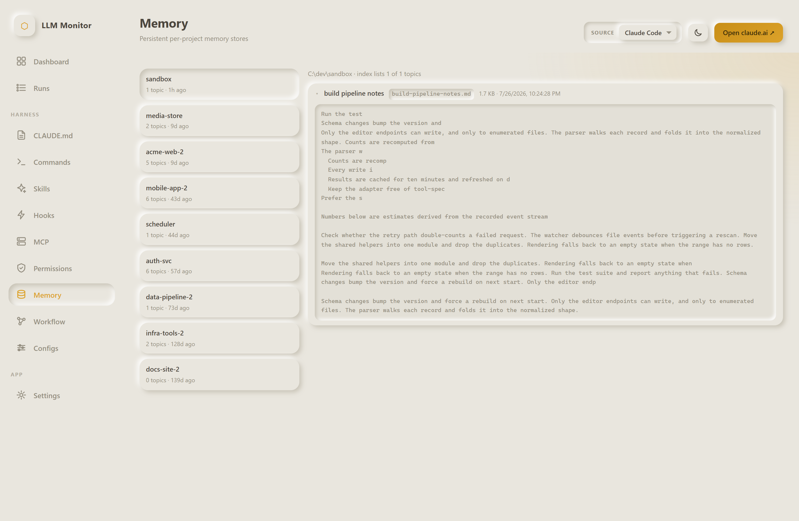

#### Workflow

Dependency analysis across skills, hooks, MCP servers and commands. The left column
lists detected **workflows** — connected components ordered hook → MCP → skill →
command — and selecting one renders just that workflow's graph with labelled edges
(solid = one component references another by name in its content, dashed = keyword
similarity) plus its numbered steps.

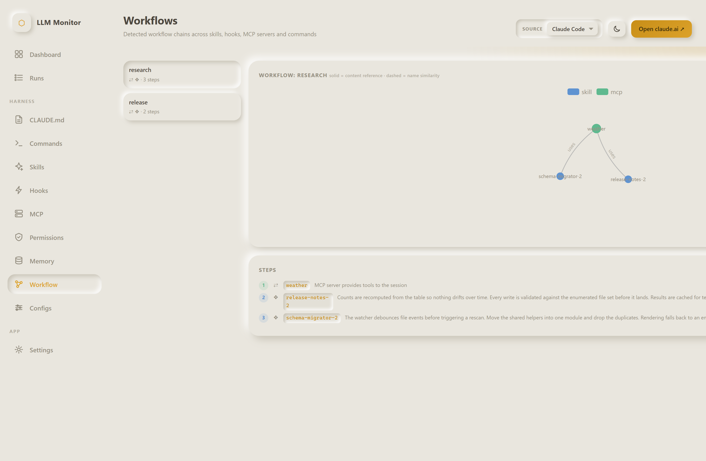

#### Configs

A read-only merged view of the settings layers: headline cards for the **default
model** and its source layer, effort level, and the most-used model of the last 7
days from your actual transcripts. Below, every key's winning value, which layers
it overrides, and warnings for keys set in a layer the tool never reads.

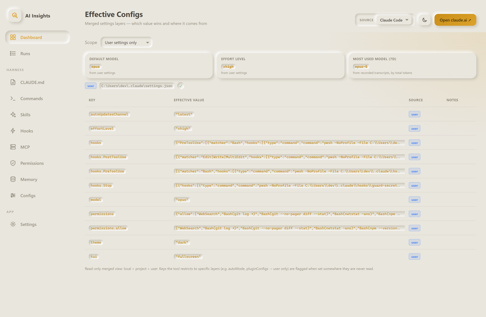

### Settings

Warning thresholds behind the ok/warn/error badges on the Harness tabs, and the
per-model reference pricing that drives every cost number in the app.

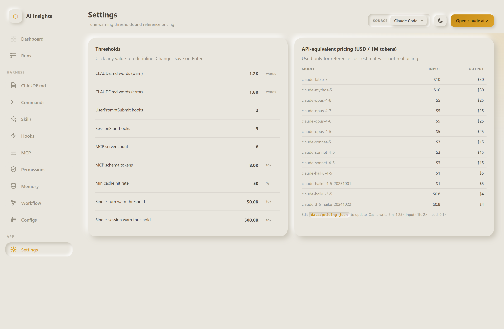

### Themes and data sources

Light (warm cream) and dark (slate) themes, toggled with the sun/moon button in the
top-right corner; the choice persists and charts re-theme in place.

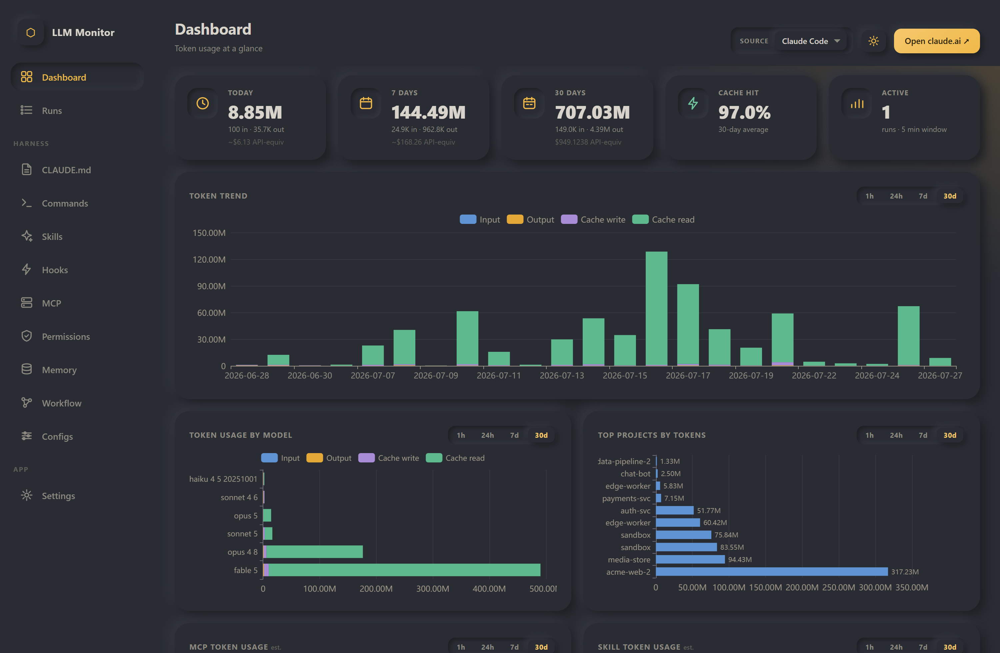

The **Source ▾** switcher in the top bar lists every registered provider and marks
which ones have data. On first launch the app picks the first provider that has
data.

---

## Documentation

| Document | Contents |
|---|---|
| [docs/architecture.md](docs/architecture.md) | The two provider seams, the Claude Code adapter, how to add a new tool, MCP probing, write safety, network binding |
| [docs/data-model.md](docs/data-model.md) | Run / agent / turn, accuracy and dedupe notes, database schema, cost estimation |
| [docs/api.md](docs/api.md) | Every HTTP endpoint |
| [docs/screenshots/](docs/screenshots/) | All UI screenshots and how they were anonymized |

## Project Structure

```
server.ts                  Entry point, Hono app, watcher startup, provider scan loop
src/
  paths.ts                 All path constants
  db.ts                    SQLite setup (bun:sqlite, WAL mode)
  tokenizer.ts             js-tiktoken wrapper
  pricing.ts               Per-model cost table + computeCost()
  thresholds.ts            Configurable warning thresholds
  providers/
    types.ts               Provider interface + NormalizedTurn shape
    index.ts               Provider registry, providerForPath / providerById lookups
    claude-code/           Self-contained Claude Code adapter
      index.ts             Exports the claudeCodeProvider object
      parser.ts            Incremental JSONL parsing, message.id dedupe, bucket classification
      agentDetail.ts       Reads a JSONL and emits NormalizedTurn[]
      agentTree.ts         Folds the transcript DAG into render-ready session trees
      titles.ts            Agent title extraction (wrapper-tag stripping)
      config/              Claude Code's ToolConfigAdapter (Harness tabs)
        index.ts           Assembles the adapter + capability flags
        shared.ts          Project discovery, plugin enumeration, override ranking
        instructions.ts    CLAUDE.md enumeration + whitelisted read/write + injection series
        commands.ts        Three-source command scan, namespacing, create/edit/delete
        skills.ts          Three-source skill scan, trigger analysis, recorded usage
        hooks.ts           Hooks across settings layers, script resolution, fire counts
        mcp.ts             MCP enumeration from config files + tool/schema probes + diagnostics
        permissions.ts     Rule parsing + layer merge + override marking
        memory.ts          Per-project memory stores (MEMORY.md index + topics)
        effective.ts       Merged settings layers with layer-restriction warnings
  config/
    types.ts               ToolConfigAdapter interface + neutral config shapes
    index.ts               Config-adapter registry (parallel to the provider registry)
    graph.ts               Provider-agnostic dependency graph builder
  transcripts/
    cache.ts               Generic SQLite read/write helpers (provider-agnostic)
    aggregate.ts           SQL aggregation queries (totals, series, agents, models, projects)
    runs.ts                Run-id resolution, activity recompute, run listing/loading
    usageReport.ts         Per-run usage breakdown (buckets, per-model costs, advice)
  watcher.ts               chokidar watcher → dispatches changes to the owning provider
  api/
    settingsEndpoints.ts   Thresholds (read/write) + pricing (read)
    transcriptEndpoints.ts Usage data: stats, timeseries, runs, agents, trees, usage reports
    configEndpoints.ts     /api/config/* — the Harness tabs
    providersEndpoint.ts   GET /api/providers
static/
  index.html               Sidebar SPA shell (12 tabs + session-detail overlay)
  style.css                Neomorphic soft-UI theme — light + dark, CSS variables
  config.css               Styles for the Harness tabs + run Usage view
  app.js                   Fetch, ECharts, theme toggle, session-tree renderer, run Usage view
  config.js                Harness tabs (claudemd/commands/skills/hooks/mcp/permissions/memory/workflow/configs)
  lib/
    echarts.min.js         Apache ECharts 5.5.1 (offline, 1007KB)
docs/                      Architecture, data model, API reference, screenshots
data/                      SQLite DB lives here (git-ignored)
```

## License

MIT — see [LICENSE](LICENSE).

---

## ☕ Support This Project

If this dashboard has helped you understand (or rein in) your LLM token spend — or just saved you from squinting at JSONL files — consider buying me a coffee. It helps keep the lights on and the side projects shipping.

**[☕ Buy Me a Coffee](https://buymeacoffee.com/starbringer)**

No pressure — the software is and always will be free.
