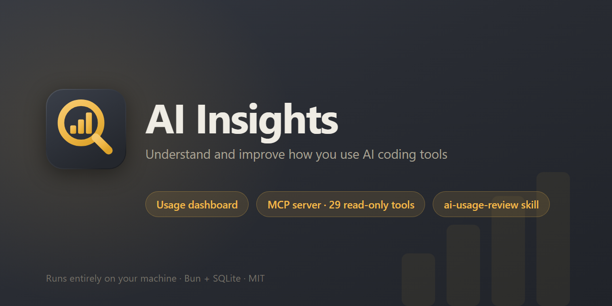

# AI Insights

**English** | [简体中文](README.zh-CN.md)

[](LICENSE)
[](https://buymeacoffee.com/starbringer)

<p align="center">
  
</p>

A local web app that turns raw AI coding-tool usage into a live dashboard — token
counts, costs, session history, configuration health.

- **Dashboard** — where your tokens and money actually go
- **Built-in MCP server** — 29 read-only tools, so your AI assistant reads the same data
- **`ai-usage-review` skill** — turns that data into ranked, evidence-backed fixes
- **Provider-agnostic** — today it parses Claude Code's JSONL transcripts; other sources can plug in later

Both the MCP server and the skill are set up automatically at startup — [details](docs/mcp.md).

**Privacy**

| | |
|---|---|
| **The app** | Never calls an AI model. No API keys, no external services, no telemetry — your transcripts never leave your machine. Parsing, token counting and every check are deterministic local computation |
| **The skill** | The one AI part. `ai-usage-review` runs inside *your* AI assistant and spends *its* tokens; the app only serves local data to it over MCP |


---

## Requirements

| | |
|---|---|
| Runtime | [Bun](https://bun.sh) ≥ 1.1 (tested on 1.3.13) |
| OS | Windows, macOS or Linux — the server behaves identically; browser auto-open picks `open` / `cmd /c start` / `xdg-open` and is skipped silently if none exists |
| Data | **Claude Code** transcripts in `~/.claude/projects/` *(currently the only built-in source)* |

## Setup

```bash
# 1. Install Bun
curl -fsSL https://bun.sh/install | bash          # macOS / Linux
powershell -c "irm bun.sh/install.ps1 | iex"      # Windows

# 2. Get the code and run it
git clone https://github.com/starbringer/ai-insights.git
cd ai-insights
bun install
bun run start
```

That's it. What happens next:

- **The browser opens** on **http://localhost:5757** (Windows, macOS, Linux with `xdg-open`) — otherwise open it yourself.
- **First start scans** every transcript under `~/.claude/projects/`, builds `data/cache.db`, then watches those files. New activity shows up within a couple of seconds, no restart. A large history takes a few seconds; the page is usable after the first pass.
- **No data yet?** The app still loads and tells you where it expected to find it.
- **Your AI gets access too** — the same command serves the MCP endpoint at `http://127.0.0.1:5757/mcp`, installs the `ai-usage-review` skill into every detected AI tool, and registers the server with each. Restart your AI tool once, then run `/ai-usage-review`.

No extra command, no second process, no Docker. Every step is idempotent and prints
one line the first time only. Opt out with `--no-provision`. Full reference:
**[docs/mcp.md](docs/mcp.md)**.

### Command-line options

```bash
bun run server.ts --port=8080 --no-browser
```

| Flag | Description |
|------|-------------|
| `--port=N` | Listen on port N (default: `5757`) |
| `--host=H` | Bind address (default: `127.0.0.1`) — the config API can edit files, so it stays loopback-only unless you opt in to `0.0.0.0`. [Why](docs/architecture.md#network-binding) |
| `--no-browser` | Don't auto-open the browser |
| `--static-only` | Skip the file watcher (and the browser) — the startup scan still runs, but later changes need a restart |
| `--no-provision` | Don't install the skill or register the MCP server with your AI tools. `/mcp` is still served |

The environment variables `PORT` and `HOST` work too.

### Scripts

| Script | Does |
|---|---|
| `bun run start` | Server + MCP endpoint (same as `bun run server.ts`) |
| `bun run dev` | Hot-reload with `--watch` |
| `bun run mcp` | MCP server over stdio, for clients that can't use HTTP |
| `bun run typecheck` | `tsc --noEmit` |
| `bun run test` | Unit test suite |
| `bun run build` | Standalone binary for the current platform |
| `bun run build:mcp` | Standalone binary of the stdio MCP server |

### Rebuilding the cache

The database is a cache — the JSONL transcripts are the only source of truth.
Delete `data/cache.db` and restart to force a clean re-parse. The app does this
itself whenever an update changes the schema version.

### Standalone executable

```bash
bun run build   # → dist/ai-insights (.exe on Windows), ~60MB, no Bun install needed
```

- Ship `static/` and `assets/` alongside the binary — all three plus the `data/` cache resolve next to the executable, so it launches from any working directory.
- Without `assets/`, everything works except installing the bundled skill.
- Cross-compile with a target: `bun build --compile --target=bun-<windows|darwin|linux>-x64 server.ts --outfile dist/ai-insights` (`bun-darwin-arm64` for Apple Silicon).

---

## Features

*Screenshots are captured from real usage with every project name, path,
conversation and configuration name replaced by consistent stand-ins — see
[docs/screenshots/](docs/screenshots/).*

### MCP server + AI usage review

Everything the dashboard shows is also a **read-only MCP server on the app's own
port** — 29 tools:

| Group | Tools cover |
|---|---|
| Usage | Totals, trends, per-model and per-project rollups, session lists, per-run cost breakdowns, top runs and turns, MCP and skill token usage |
| Harness config | Instruction files, commands, skills, hooks, permissions, MCP servers, memory, effective settings, dependency graph |

The bundled **`ai-usage-review` skill** is what makes that useful: it pulls the
numbers, runs eleven diagnostic checks, and reports at most seven findings ranked
by estimated saving — each citing the measurement it came from.

| Finding | What it tells you |
|---|---|
| **Instruction files taxing every turn** | A CLAUDE.md is re-sent on every request of every session — it sizes that tax and says what to move into a skill |
| **Premium models doing routine work** | Re-priced from your actual calls, not a generic percentage |
| **Prompt cache not being hit** | And which habit is invalidating it |
| **Skills and MCP servers that don't pay for themselves** | Token cost carried against recorded invocations |
| **Repeated work that should be a skill, command or hook** | The same task shape three times in a month is worth capturing once |
| **Dead or misconfigured config** | Hooks that never fire, shadowed commands, settings written to a layer the tool never reads |

It also answers design questions against your real setup: *skill or hook? what
belongs in CLAUDE.md? why doesn't my skill trigger?*

**Every tool is read-only by design.** The review proposes; your assistant applies
what you accept through its normal, permission-gated edit tools. Tool reference,
check list, other clients (including stdio) and what is deliberately not exposed:
**[docs/mcp.md](docs/mcp.md)**.

### Dashboard

- **Five KPI cards** — today / 7-day / 30-day totals with API-equivalent cost, cache hit rate, active runs
- **Token trend chart** — split into input, output, cache write and cache read
- **Below that** — usage by model, top projects, **MCP token usage** (per-server, with a per-tool tooltip), **skill token usage**, **cache hit rate** with a 50% guide line, **model mix**, and **top 10 runs** (click a bar to jump into that run)


Every chart has its own range switcher — `1h` / `24h` / `7d` / `30d` — and remembers
your choice. Costs are API-equivalent reference numbers from an editable pricing
table, not billing; [details](docs/data-model.md#cost-estimation).

### Runs

Every recorded session with title, project, agent count (`× N` when a run spawned
sub-agents), turns, token totals and last-active time. Searchable and filterable by
project.


A **run** is one logical session → one or more **agents** (one transcript each) →
**turns** (one API call each). [More on the model](docs/data-model.md#run--agent--turn).

### Run detail — session tree

Click **View** on any run for a three-panel replay: agents on the left, the tree in
the middle, full node detail on the right.


Each agent gets its own tree, stacked in one scrollable view. The spine is the
chronological flow — prompts, LLM calls, hook fires, compactions, errors — and each
LLM call expands into its thinking, text output and every tool call in order:

| | Node | | Node |
|---|---|---|---|
| ⚙ | Plain tool | ⚡ | Hook, with command and duration |
| ⇄ | MCP call | ✕ | API error / rate-limit retry |
| ◈ | Sub-agent spawn, with a `tree ↓` jump link | ▣ | Compaction, pre → post tokens |
| ❖ | Skill invocation, injected body nested underneath | ⤷ | Model refusal fallback |
| ⎇ | Abandoned branch (prompt edits, retries), collapsed | ✚ | Injected context |

The top bar totals the session: prompts, LLM calls, tools, MCP, sub-agents, hooks,
errors, compactions, branches. On narrow screens the side panels collapse into
top-bar toggles.

### Run detail — usage

The middle column's second tab is a cost breakdown for that one run, from the same
deduplicated data as the dashboard.


- KPI cards, a cumulative spend curve and a per-model table
- **Cost-by-bucket donut** — base / MCP / skills / sub-agents, every API call classified at parse time from its tool calls
- **Tuning advice** from this run's real numbers — *"re-priced at a cheaper model these calls would cost $X (Y%) less"*, low cache-hit warnings, sub-agent-heavy runs

### Harness

The **Harness** group inspects — and where safe, edits — the active tool's
configuration. Each tab appears only if the active provider supports that
capability, so a future adapter for another tool simply shows fewer tabs. Most tabs
share one layout: a list column and a detail column, each scrolling on its own.

#### CLAUDE.md

Every instruction file the tool injects: the global `~/.claude/CLAUDE.md` plus
`CLAUDE.md` / `.claude/CLAUDE.md` for every project your transcripts have touched
(missing ones listed as creatable). Per-file token and word counts, an inline editor
with **Save**, and a timeline of injected tokens per day.


#### Commands

Slash commands from all three sources — user, project, enabled plugins — with
`:`-namespacing, argument hints, `$ARGUMENTS` detection, token cost, search, and
**same-name override detection** so you can see which definition wins. User and
project commands are editable; plugin commands are read-only.


#### Skills

Override detection, SKILL.md token cost, `references/` and `scripts/` listings,
**recorded** invocations and injected tokens over 30 days, and a **trigger
analyzer** showing which prompt keywords would activate the skill.


#### Hooks

Every hook across every settings layer, with its matcher, action type and
**recorded fire count** for the last 30 days — from the event stream, not estimated.


Actions that run a script file (`.ps1`, `.sh`, `.py`, …) are resolved on disk: click
one to read, edit and save it. Removing a hook deletes its entry from the settings
file and leaves the script on disk.


#### MCP

Servers with scope, transport and tool count on the left; command, source file,
probe status, 30-day injection estimate and expandable tools with descriptions and
JSON schemas on the right. Diagnostics live in the default panel; a re-probe button
bypasses the 10-minute cache.


Servers are enumerated from config files rather than the CLI, and project-scope
servers you haven't approved are listed but never executed —
[why](docs/architecture.md#mcp-why-config-files-not-the-cli).

#### Permissions

`allow` / `deny` / `ask` rules parsed into tool + specifier across the user layer
and, via the project selector, a project's settings and local settings. Shows the
merged effective set; a rule shadowed by a higher-priority layer is struck through.


#### Memory

Per-project persistent memory stores: the MEMORY.md index, every topic file with its
content, size and last-modified time, and an **orphan** badge for files that exist
but aren't linked from the index.


#### Workflow

Dependency analysis across skills, hooks, MCP servers and commands. The left column
lists detected **workflows** — connected components ordered hook → MCP → skill →
command. Selecting one renders that workflow's graph with labelled edges (solid =
one component references another by name, dashed = keyword similarity) plus its
numbered steps.


#### Configs

A read-only merged view of the settings layers: headline cards for the **default
model** and its source layer, effort level, and the most-used model of the last 7
days from your actual transcripts. Below, every key's winning value, which layers it
overrides, and warnings for keys set in a layer the tool never reads.


### Settings

Warning thresholds behind the ok/warn/error badges on the Harness tabs, and the
per-model reference pricing that drives every cost number in the app.


### Themes and data sources

Light (warm cream) and dark (slate) themes, toggled with the sun/moon button in the
top-right corner; the choice persists and charts re-theme in place.


The **Source ▾** switcher in the top bar lists every registered provider and marks
which ones have data. On first launch the app picks the first provider that has data.

---

## Documentation

| Document | Contents |
|---|---|
| [docs/mcp.md](docs/mcp.md) | The MCP server and the `ai-usage-review` skill: setup, every tool, other clients, what is not exposed, security |
| [docs/architecture.md](docs/architecture.md) | The two provider seams, the Claude Code adapter, how to add a new tool, the MCP server, provisioning, MCP probing, write safety, network binding |
| [docs/data-model.md](docs/data-model.md) | Run / agent / turn, accuracy and dedupe notes, database schema, cost estimation |
| [docs/api.md](docs/api.md) | Every HTTP endpoint, and the `?provider=` selector they all accept |
| [docs/screenshots/](docs/screenshots/) | All UI screenshots and how they were anonymized |

## Project Structure

```
server.ts                  Entry point, Hono app, watcher startup, provider scan loop, provisioning
mcp-stdio.ts               MCP server over stdio, for clients that can't use HTTP
src/
  paths.ts                 All path constants
  provision.ts             Provider-agnostic startup provisioning (skills + MCP registration)
  db.ts                    SQLite setup (bun:sqlite, WAL mode)
  tokenizer.ts             js-tiktoken wrapper
  pricing.ts               Per-model cost table + computeCost()
  thresholds.ts            Configurable warning thresholds
  providers/
    types.ts               Provider interface + NormalizedTurn shape
    index.ts               Provider registry, providerForPath / providerById lookups
    claude-code/           Self-contained Claude Code adapter
      index.ts             Exports the claudeCodeProvider object
      parser.ts            Incremental JSONL parsing, message.id dedupe, bucket classification
      agentDetail.ts       Reads a JSONL and emits NormalizedTurn[]
      agentTree.ts         Folds the transcript DAG into render-ready session trees
      titles.ts            Agent title extraction (wrapper-tag stripping)
      config/              Claude Code's ToolConfigAdapter (Harness tabs)
        index.ts           Assembles the adapter + capability flags
        shared.ts          Project discovery, plugin enumeration, override ranking
        instructions.ts    CLAUDE.md enumeration + whitelisted read/write + injection series
        commands.ts        Three-source command scan, namespacing, create/edit/delete
        skills.ts          Three-source skill scan, trigger analysis, recorded usage
        hooks.ts           Hooks across settings layers, script resolution, fire counts
        mcp.ts             MCP enumeration from config files + tool/schema probes + diagnostics
        permissions.ts     Rule parsing + layer merge + override marking
        memory.ts          Per-project memory stores (MEMORY.md index + topics)
        effective.ts       Merged settings layers with layer-restriction warnings
        provision.ts       Skill install + `claude mcp add` registration
  config/
    types.ts               ToolConfigAdapter interface + neutral config shapes
    index.ts               Config-adapter registry (parallel to the provider registry)
    graph.ts               Provider-agnostic dependency graph builder
  transcripts/
    cache.ts               Generic SQLite read/write helpers (provider-agnostic)
    aggregate.ts           SQL aggregation queries (totals, series, agents, models, projects)
    runs.ts                Run-id resolution, activity recompute, run listing/loading
    usageReport.ts         Per-run usage breakdown (buckets, per-model costs, advice)
  watcher.ts               chokidar watcher → dispatches changes to the owning provider
  mcp/
    tools.ts               MCP tool registry — read-only, provider-aware
    protocol.ts            Transport-independent JSON-RPC / MCP dispatch
  api/
    providerParam.ts       Shared ?provider= resolution (HTTP + MCP)
    settingsEndpoints.ts   Thresholds (read/write) + pricing (read)
    transcriptEndpoints.ts Usage data: stats, timeseries, runs, agents, trees, usage reports
    configEndpoints.ts     /api/config/* — the Harness tabs
    providersEndpoint.ts   GET /api/providers
    mcpEndpoint.ts         POST /mcp (streamable HTTP) + GET /api/mcp-server
static/
  index.html               Sidebar SPA shell (12 tabs + session-detail overlay)
  favicon.svg              Browser-tab icon, flattened for legibility at 16px
  style.css                Neomorphic soft-UI theme — light + dark, CSS variables
  config.css               Styles for the Harness tabs + run Usage view
  app.js                   Fetch, ECharts, theme toggle, session-tree renderer, run Usage view
  config.js                Harness tabs (claudemd/commands/skills/hooks/mcp/permissions/memory/workflow/configs)
  lib/
    echarts.min.js         Apache ECharts 5.5.1 (offline, 1007KB)
assets/
  icon.svg                 Master app icon, 512×512 (static/favicon.svg is the 32px cut)
  social-preview.png       GitHub social preview, 1280×640 — rendered from the .html beside it
  skills/
    ai-usage-review/       The skill installed into every detected AI tool
      SKILL.md             Workflow: scope → gather → diagnose → report → apply
      references/          The 11 checks, and how to author skills/hooks/subagents
docs/                      Architecture, data model, API + MCP reference, screenshots
data/                      SQLite DB lives here (git-ignored)
```

## License

MIT — see [LICENSE](LICENSE).

---

## ☕ Support This Project

If this dashboard has helped you understand (or rein in) your LLM token spend,
consider buying me a coffee.

**[☕ Buy Me a Coffee](https://buymeacoffee.com/starbringer)**

No pressure — the software is and always will be free.
